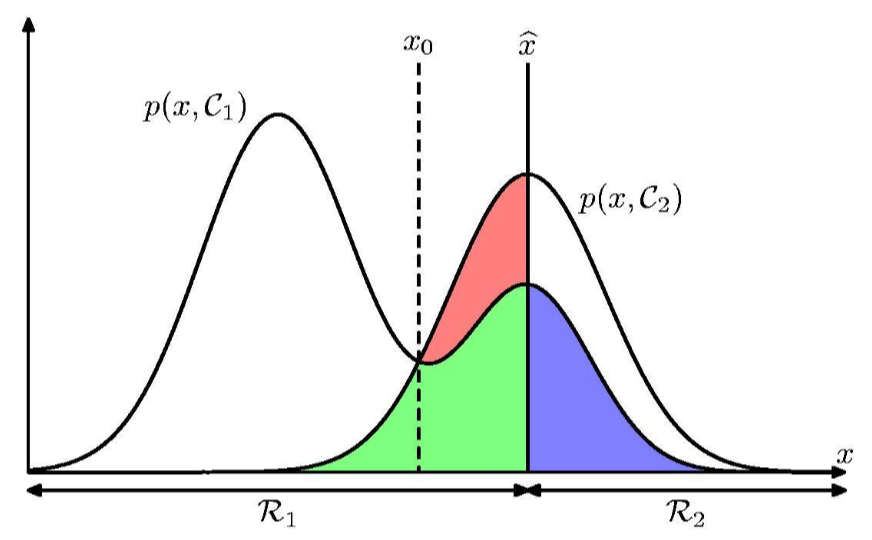

# CS329 Homework #1

*Course: Machine Learning(H)(CS329) - Instructor: Qi Hao*

Name: Jianan Xie(谢嘉楠)

SID: 12110714

## Question 1

Consider the polynomial function:

$$
y(x,\mathbf{w})=w_{0}+w_{1}x+w_{2}x+...+w_Mx^M=\sum^M_{i=0}w_ix^i
$$
Calculate the coefficients $\mathbf{w}=\{w_i\}$ that minimize its sum-of-squares error function. Here a suffix $i$ denotes the index of a component, whereas $(x)^i$ denotes $x$ raised to the power of $i$.

**Ans**: 

The sum-of-squares error function of this polynomial fitting function is $E(w) = \frac{1}{2} \sum_{n=1}^{N}\{y(x_n,w)-y_n\}^2$ , and here we denote that  $ \mathbf{w}=[w_0,w_1,...,w_M]^T $ , $\mathbf{x_i} = [1,x_i,x_i^2,...,x_i^M]^T$ ,  $\mathbf{y}=[y_1,y_2,...,y_N]^T$ and $\mathbf{X} = \begin{bmatrix} x_1^T \\ x_2^T  \\ \vdots \\ x_N^T  \end{bmatrix}$. Thus, we rewrite $E(w)$ as following format:
$$
\begin{align}
E(w) &= \frac{1}{2} \sum_{n=1}^{N}\{w^Tx_n-y_n\}^2 = \frac{1}{2} \sum_{n=1}^{N}\{y_n -x_n^Tw\}^2 \\&=\frac{1}{2}\begin{bmatrix} y_1 - x_1^Tw\quad \dots \quad y_N - x_N^Tw \end{bmatrix}\begin{bmatrix} y_1 - x_1^Tw \\ y_2 - x_2^Tw\\ \vdots \\ y_N - x_N^Tw  \end{bmatrix}
\\&= \frac{1}{2} (\mathbf{y}-\mathbf{Xw})^T(\mathbf{y}-\mathbf{Xw})
\end{align}
$$

then we need to find the $\mathbf{w}$ to minimize $E(w)$, that is when $\frac{\partial{E(w)}}{\partial{w}}= 0$. We should know some matrix differential formula.:
$$
\begin{align}
&\frac{\partial a^Tx}{\partial x} = \frac{\partial x^Ta}{\partial x}=a \tag{1}
\\
\\
&\frac{\partial x^TAx}{\partial x} = (A+A^T)x  \tag{2}
\end{align}
$$
next we find the $\mathbf{\hat w}$ to make $\frac{\partial E(\hat w)}{\partial \hat w}=0$ 
$$
\begin{align}
\\
\frac{\partial E(w)}{\partial w} &=  \frac{1}{2} \frac{\partial(\mathbf{y}-\mathbf{Xw})^T(\mathbf{y}-\mathbf{Xw})}{\partial w}
\\&=\frac{1}{2} \frac{\partial (\mathbf{y^T y}-\mathbf{w^T X^T y}-\mathbf{y^T Xw}+\mathbf{w^T X^T Xw})}{\partial w}
\\&=\frac{1}{2} (\frac{\partial \mathbf{y^T y}}{\partial w} - \frac{\partial \mathbf{w^T X^T y}}{\partial w}-\frac{\partial \mathbf{y^T Xw}}{\partial w} + \frac{\partial \mathbf{w^T X^T Xw}}{\partial w})
\\&=\frac{1}{2} (0-\mathbf{X^T y}-\mathbf{X^T y}+\mathbf{(X^T X + X^T X)w}) \tag{becuase of (1) and (2) }
\\&= \mathbf{X^T Xw-X^T y}
\\&= 0
\end{align}
$$
So, $\mathbf{X^T X\hat w-X^T y} = 0$ ,then we get $\mathbf{\hat w} = \mathbf{(X^T X)^{-1} X^T y}$ , if $\mathbf{X^T X}$ is invertible. In other cases, we should choose a suitble $\mathbf{\hat w}$ ,s.t.   $\mathbf{X^T X\hat w-X^T y} = 0$.

## Question 2

Suppose that we have three colored boxes $r(\mathrm{red})$, $b(\mathrm{blue})$, and $g(\mathrm{green})$. Box $r$ contains 3 apples, 4 oranges, and 3 limes, box $b$ contains 1 apple, 1 orange, and 0 limes, and box $g$ contains 3 apples, 3 oranges, and 4 limes. If a box is chosen at random with probabilities $p(r)=0.2, p(b) = 0.2, p(g) = 0.6$, and a piece of fruit is removed from the box (with equal probability of selecting any of the items in the box), then what is the probability of selecting an apple? If we observe that the selected fruit is in fact an orange, what is the probability that it came from the green box?

**Ans**:

$P(apple|r) = 3/(3+4+3)=\frac{3}{10}=0.3$ ,

 $P(apple|b)=1/(1+1+0)=\frac{1}{2}=0.5$ ,

 $P(apple|g)=3/(3+3+4)=\frac{3}{10}=0.3$.

so, $P(apple)=P(apple|r)P(r)+P(apple|b)P(b)+P(apple|g)P(g)=0.3\times0.2+0.5\times0.2+0.3\times0.6=0.34$

$P(orange|r) = 4/(3+4+3)=\frac{4}{10}=0.4$,

$P(orange|b) = 1/(1+1+0)=\frac{1}{2}=0.5$,

$P(orange|g) = 3/(3+3+4)=\frac{3}{10}=0.3$

so, $P(g|orange)=\frac{P(orange|g)P(g)}{P(orange|r)P(r)+P(orange|b)P(b)+P(orange|g)P(g)}=\frac{0.3\times0.6}{0.4\times0.2+0.5\times0.2+0.3\times0.6}=0.5$.   

## Question 3

Given two statistically independent variables $x$ and $z$, show that the mean and variance of their sum satisfies
$$
\mathbb{E}[x+z]=\mathbb{E}[x]+\mathbb{E}[z]
$$

$$
\mathrm{var}[x+z] = \mathrm{var}[x]+\mathrm{var}[z]
$$

**Ans**:

- If **x** and **z** are both discrete statistically independent variables.

$$
\begin{align}
E[x+z]&=\sum_x\sum_z{(x+z)p(x,z)}
\\&=\sum_x\sum_z{(x+z)p(x)p(z)}
\\&=\sum_x\sum_z(xp(x)p(z)+zp(z)p(x))
\\&=\sum_xxp(x)+E[z]\sum_xp(x)
\\&=E[x] +E[z]
\end{align}
$$

- If **x** and **z** are both continuous statistically independent variables.

$$
\begin{align}
E[x+z]&=\int_x\int_z(x+z)f(x,z)dzdx
\\&=\int_x\int_z(x+z)f(x)f(z)dzdx
\\&=\int_x(xf(x)dx\int_zf(z)dz+f(x)dx\int_zzf(z)dz)
\\&=\int_x(xf(x)dx+E[z]f(x)dx)
\\&=\int_xxf(x)dx+E[z]\int_xf(x)dx
\\&=E[x]+E[z]
\end{align}
$$

Next, we prove $var[x+z]=var[x]+var[z]$
$$
\begin{align}
var[x+z]&=E\{[(x+z)-E[x+z]]^2\}
\\&=E[(x+z)^2]-(E[x+z])^2
\\&=E[x^2+2xz+z^2]-(E[x]+E[z])^2
\\&=E[x^2]+2E[x]E[z]+E[z^2]-(E[x])^2-2E[x]E[z]-(E[z])^2
\\&=E[x^2]-(E[x])^2+E[z^2]-(E[z])^2
\\&=var[x]+var[z]
\end{align}
$$

## Question 4

In probability theory and statistics, the Poisson distribution, is a discrete probability distribution that expresses the probability of a given number of events occurring in a fixed interval of time or space if these events occur with a known constant rate and independently of the time since the last event. If ${X}$ is Poisson distributed, i.e. $X\sim Possion(\lambda)$, its probability mass function takes the following form: 

$$
P(X|\lambda)=\frac{\lambda^Xe^{-\lambda}}{X!}
$$
It can be shown that if $\mathbb{E}(X) = \lambda$. Assume now we have $n$ data points from $Possion(\lambda): \mathcal{D}=\{X_1, X_2,..., X_n\}$. Show that the sample mean $\widehat{\lambda}=\frac{1}{n}\sum^n_{i=1}X_i$ is the maximum likelihood estimate(MLE) of $\lambda$.

If $X$ is exponential distribution and its distribution density function is $f(x)=\frac{1}{\lambda}e^{-\frac{x}{\lambda}}$ for $x>0$ and $f(x)=0$ for $x\leq0$. Show that the sample mean $\widehat{\lambda}\frac{1}{n}\sum^n_{i=1}X_i$ is the maximum likelihood estimate(MLE) of $\lambda$.

**Ans**:

$X\sim Possion(\lambda)$: $L(\lambda;D)=\prod_{i=1}^{n}P(X_i|\lambda)=\frac{\lambda^{\sum_{i=1}^{n}X_i}e^{-n\lambda}}{\prod_{i=1}^{n}X_i!}$ and $\ln L(\lambda;D)=\sum_{i=1}^{n}X_i\ln\lambda-n\lambda-\sum_{i=1}^{n}\ln X_i!$
$$
\begin{align}
\frac{\partial\ln L(\lambda;D)}{\partial\lambda}&=\frac{\partial}{\partial \lambda}(\sum_{i=1}^{n}X_i\ln\lambda-n\lambda-\sum_{i=1}^{n}\ln X_i!)
\\&=\sum_{i=1}^{n}X_i\frac{1}{\lambda}-n
\\&=0
\end{align}
$$
Then we get the MLE of $\lambda$ is $\hat \lambda=\frac{1}{n}\sum_{i=1}^{n}X_i$

$X\sim P(\lambda)$: $L(\lambda;D)=\prod_{i=1}^{n}f(X_i)=\frac{1}{\lambda^n}e^{-\frac{\sum_{i=1}^{n}X_i}{\lambda}}$ and $\ln L(\lambda;D)=-\frac{\sum_{i=1}^{n}X_i}{\lambda}-n\ln \lambda$
$$
\begin{align}
\frac{\partial\ln L(\lambda;D)}{\partial\lambda}&=\frac{\partial}{\partial \lambda}(-\frac{\sum_{i=1}^{n}X_i}{\lambda}-n\ln \lambda)
\\&=\frac{\sum_{i=1}^{n}X_i}{\lambda^2}-\frac{n}{\lambda}
\\&=0
\end{align}
$$
Then we get the MLE of $\lambda$ is $\hat \lambda=\frac{1}{n}\sum_{i=1}^nX_i$

## Question 5

*(a)* Write down the probability of classifying correctly $p(correct)$ and the probability of misclassification $p(mistake)$ according to the following chart.

**Ans**:

$p(correct)=\int_{R_1}p(x,C_1)dx+\int_{R_2}p(x,C_2)dx$, $p(mistake)=\int_{R_2}p(x,C_1)dx+\int_{R_1}p(x,C_2)dx$.

*(b)* For multiple target variables described by vector $\mathbf{t}$, the expected squared loss function is given by
$$
\mathbb{E}[\mathit{L}\mathbf{(t, y(x))}]=\int\int \left \| \mathbf{y(x)-t} \right \|^2p(\mathbf{x, t})\mathrm{d}\mathbf{x}\mathrm{d}\mathbf{t}
$$
Show that the function $\mathbf{y(x)}$ for which this expected loss is minimized given by $\mathbf{y(x)}=\mathbb{E}\mathbf{_t[t|x]}$.

> #### Hints
>
> For a single target variable $t$, the loss is given by
>
> $\mathbb{E}[\mathit{L}]=\int\int\{y(\mathbf{x})-t\}^2p(\mathbf{x}, t)\mathrm{d}\mathbf{x}\mathrm{dt}$
>
> The result is as follows
>
> $y(\mathbf{x})=\frac{\int tp(\mathbf{x}, t)\mathrm{dt}}{p(\mathbf{x})}=\int tp(t|\mathbf{x})\mathrm{dt}=\mathbb{E}_t[t|\mathbf{x}]$

**Ans**:

Our goal is to find a $\mathbf{y(x)}$ so as to minimize $\mathbf{E[L(t,y(x))]}$ , we do this formally using the calculus of variations to give
$$
\frac{\delta{E[L(\mathbf{t,y(x)})]}}{\delta{\mathbf{y(x)}}}= \int{2(\mathbf{y(x)-t})p(\mathbf{t,x})d\mathbf{t}=0}
$$
Solving the $\mathbf{y(x)}$:
$$
\mathbf{y(x)} = \frac{\int{\mathbf{t}p(\mathbf{t,x})d\mathbf{t}}}{\int{p(\mathbf{t,x})d\mathbf{t}}}=\frac{\int{\mathbf{t}p(\mathbf{t,x})d\mathbf{t}}}{p(\mathbf x)}=\int{\mathbf{t}p(\mathbf{t|x})d\mathbf{t}}=E_\mathbf t[\mathbf{t|x}]
$$

## Question 6

*(a)* We defined the entropy based on a discrete random variable $\mathbf{X}$ as
$$
\mathbf{H[X]}=-\sum_{i}p(x_i)\mathrm{ln} p(x_i)
$$
Now consider the case that $\mathbf{X}$ is a continuous random variable with the probability density function $p(x)$. The entropy is defined as

$$
\mathbf{H[X]}=-\int p(x)\mathrm{ln} p(x) dx
$$
Assume that $\mathbf{X}$ follows Gaussian distribution with the mean $\mu$ and variance $\sigma$, i.e.

$$
p(x)=\frac{1}{\sqrt{2\pi}\sigma}e^{-\frac{(x-\mu)^2}{2\sigma^2}}
$$
Please derive its entropy $\mathbf{H[X]}$.

**Ans**:
$$
\begin{align}
\mathbf{H[X]}&=-\int{p(x)\ln{p(x)dx}}
\\&=-\int{p(x)[-\frac{(x-\mu)^2}{2\sigma^2}-\ln{\sqrt{2\pi}\sigma}]dx}
\\&=\frac{1}{2\sigma^2}\int{(x-\mu)^2p(x)dx}+\frac{1}{2}\ln{(2\pi\sigma^2)}\int{p(x)dx}
\\&=\frac{1}{2\sigma^2}\times\sigma^2+\frac{1}{2}\ln{(2\pi\sigma^2)}\tag{definition of variance}
\\&=\frac{1}{2}+\frac{1}{2}\ln{(2\pi\sigma^2)}
\end{align}
$$

*(b)* Write down the mutual information $\mathbf{I(y,x)}$. Then show the following equation
$$
\mathbf{I[x,y]=H[x]-H[x|y]=H[y]-H[y|x]}
$$

**Ans**:
$$
\mathbf{I[x,y]}\equiv{KL(p(x,y)||p(x)p(y))}=-\int{\int{p(x,y)\ln{(\frac{p(x)p(y)}{p(x,y)})}dxdy}}
$$
proof of   $\mathbf{I[x,y]=H[x]-H[x|y]=H[y]-H[y|x]}$:
$$
\begin{align}
\mathbf{I[x,y]}&=-\int{\int{p(x,y)\ln{(\frac{p(x)p(y)}{p(x,y)})}dxdy}}
\\&=-\int{\int{p(x,y)\ln{(\frac{p(x)}{p(x|y)})}dxdy}}
\\&=-\int{\int{p(x,y)\ln{p(x)}dxdy}}+\int{\int{p(x,y)\ln{p(x|y)}dxdy}}
\\&=-\int{\int{\ln{p(x)}p(x,y)dydx}}+\int{\int{p(x,y)\ln{p(x|y)}dxdy}}
\\&=-\int{p(x)\ln{p(x)dx}}+\int{\int{p(x,y)\ln{p(x|y)}dxdy}}
\\&=\mathbf{H[x]-H[x|y]}
\\
\\
and\quad
\\
\\
\mathbf{I[x,y]}&=-\int{\int{p(x,y)\ln{(\frac{p(x)p(y)}{p(x,y)})}dxdy}}
\\&=-\int{\int{p(x,y)\ln{(\frac{p(y)}{p(y|x)})}dxdy}}
\\&=-\int{\int{p(x,y)\ln{p(y)}dxdy}}+\int{\int{p(x,y)\ln{p(y|x)}dxdy}}
\\&=-\int{\int{\ln{p(y)}p(x,y)dxdy}}+\int{\int{p(x,y)\ln{p(y|x)}dxdy}}
\\&=-\int{p(y)\ln{p(y)dy}}+\int{\int{p(x,y)\ln{p(y|x)}dxdy}}
\\&=\mathbf{H[y]-H[y|x]}
\end{align}
$$
