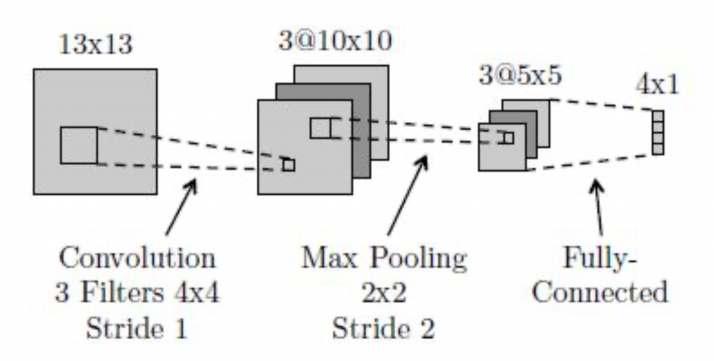
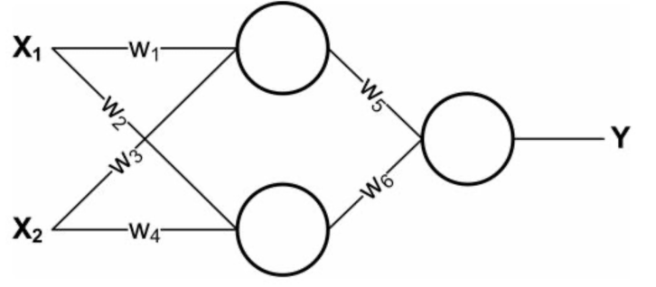

# CS329 Homework #5

*Course: Machine Learning(H)(CS329) - Instructor: Qi Hao*

Name: Jianan Xie(谢嘉楠)

SID: 12110714

## Question 1

Consider a regression problem involving multiple target variables in which it is assumed that the distribution of the targets, conditioned on the input vector $\mathbf{x}$, is a Gaussian of the form
$$
p(\mathbf{t|x,w})=N(\mathbf{t|y(x,w), \Sigma})
$$
where $\mathbf{y(x,w)}$ is the output of a neural network with input vector $\mathbf{x}$ and weight vector $\mathbf{w}$, and $\mathbf{\Sigma}$ is the covariance of the assumed Gaussian noise on the targets.

(a) Given a set of independent observations of $\mathbf{x}$ and $\mathbf{t}$, write down the error function that must be minimized in order to find the maximum likelihood solution for $\mathbf{w}$, if we assume that $\mathbf{\Sigma}$ is fixed and known.

##### Ans:

We take negative logarithm of likelihood function as error function:
$$
E(\mathbf{w,\Sigma})=\frac{1}{2}\sum_{n=1}^{\rm N}\{[\mathbf{y(x_n,w)-t_n]^{\mathrm{T}}\Sigma^{-1}[y(x_n,w)-t_n]}\}+\frac{\rm N}{2}\ln|\mathbf{\Sigma}|+const. \tag{1}
$$
Here 'const' represents terms irrelevant to both $\mathbf{w}$ and $\mathbf{\Sigma}$. If $\Sigma$ is fixed and known, the NLL function can be simplified as 
$$
E(\mathbf{w})=\frac{1}{2}\sum_{n=1}^{\rm N}\{[\mathbf{y(x_n,w)-t_n]^{\mathrm{T}}\Sigma^{-1}[y(x_n,w)-t_n]}\}+const. \tag{2}
$$
Here 'const' represents terms only irrelevant to $\mathbf{w}$. Then we calculate the partial derivative of $E(\mathbf{w})$ to $\mathbf{w}$, and set it as zero to get the maximum likelihood solution for $\mathbf{w}$.

(b) Now assume that $\mathbf{\Sigma}$ is also to be determined from the data, and write down an expression for the maximum likelihood solution for $\mathbf{\Sigma}$. (Note: The optimizations of $\mathbf{w}$ and $\mathbf{\Sigma}$ are now coupled.)

##### Ans:

If $\mathbf{\Sigma}$ is also to be determined from data, we should minimize the equation (1) to find the ML solution for $\mathbf{\Sigma}$. We calculate the partial derivative of $E(\mathbf{w,\Sigma})$ to $\mathbf{\Sigma}$, and set it as zero to get the maximum likelihood solution for $\mathbf{\Sigma}$. The expression is under blow:
$$
\mathbf{\Sigma} = \frac{1}{\rm N} \sum_{n=1}^{\rm N} [\mathbf{y(x_n,w)-t_n][y(x_n,w)-t_n]^\mathrm{T}} \tag{3}
$$
 which is related to the ML solution for $\mathbf{w}$, meanwhile the ML solution for $\mathbf{w}$ is also related to $\mathbf{\Sigma}$. The optimizations of $\mathbf{w}$ and $\mathbf{\Sigma}$ are now coupled. Furthermore, we can use EM algorithm to find the maximum likelihoodd solution for $\mathbf{w}$ and $\mathbf{\Sigma}$.

## Question 2

The error function for binary classification problems was derived for a network having a logistic sigmoid output activation function, so that $0\leq y(\mathbf{x,w}) \leq 1$, and data having target values $t \in \{0,1\}$. Derive the corresponding error function if we consider a network having an output $-1\leq y(\mathbf{x,w}) \leq 1$ and target values $t=1$ for class $C_1$and $t=-1$ for class $C_2$. What would be the appropriate choice of output unit activation function?

> #### Hint.The error function is given by:
>
> $$E(\mathbf{w})=-\sum_{n=1}^{\rm N}\{t_n\ln y_n+(1-t_n)\ln (1-y_n)\}.$$

##### Ans:

So we need to find an output activation function whose range is $[-1,1]$. One simple way is to define a linear mapping from $\sigma(a)$ to a new $h(a)$. And it's obvious that $h(a)=2\sigma(a)-1$ satisfies the requirements, which maps  variable $a$ from $(-\infin,\infin)$ to $[-1,1]$. And conditional distribution of targets given inputs can be written as $p(t|\mathbf{x,w})=[\frac{1+y(\mathbf{x,w})}{2}]^{(\frac{1+t}{2})}[\frac{1-y(\mathbf{x,w})}{2}]^{(\frac{1-t}{2})}$ where $p(C_1|x)=\frac{1+y(\mathbf{x,w})}{2}$ and $p(C_2|x)=\frac{1-y(\mathbf{x,w})}{2}$.

Thus we derive the corresponding error function:
$$
\begin{align}
E(\mathbf{w})&=-\sum_{n=1}^{\rm N}\{(\frac{1+t_n}{2})\ln (\frac{1+y_n}{2})+(\frac{1-t_n}{2})\ln (\frac{1-y_n}{2})\}
\\&=-\frac{1}{2}\sum_{n=1}^{\rm N}\{(1+t_n)\ln (1+y_n)+(1-t_n)\ln (1-y_n)\}+\rm{N}\ln 2\tag{4}
\end{align}
$$

## Question 3

Verify the following results for the conditional mean and variance of the mixture density network model.

(a) $$\mathbb E[\mathbf{t|x}]=\int \mathbf{t}p(\mathbf{t|x})dt=\sum_{k=1}^K\pi_k(\mathbf{x})\mu_k(\mathbf{x})$$.

##### Ans：

$$
\begin{align}
\mathbb E[\mathbf{t|x}]&=\int \mathbf{t}p(\mathbf{t|x})dt
\\&=\int \mathbf{t}\sum_{k=1}^{K}\mathbf{\pi_k}N(\mathbf{t|\mu_k,\sigma_k^2})dt
\\&=\sum_{k=1}^{K}\mathbf{\pi_k}\int \mathbf{t}N(\mathbf{t|\mu_k,\sigma_k^2})dt \tag{$\mathbb E[x]=\int{xN(x|\mu,\sigma^2)dx=\mu}$}
\\&=\sum_{k=1}^K\pi_k(\mathbf{x})\mu_k(\mathbf{x})
\end{align}
$$

(b) $$s^2(\mathbf{x})=\sum_{k=1}^{K}\pi_k(\mathbf{x})\{L\sigma_k^2(\mathbf{x})+||\mu_k(\mathbf{x})-\sum_{l=1}^{K}\pi_l(\mathbf{x})\mu_l(\mathbf{x})||^2\}$$.

##### Ans:

$$
\begin{align}
s^2(\mathbf{x})&=\mathbb E[||\mathbf{t}-\mathbb E[\mathbf{t|x}]||^2|\mathbf{x}]
\\&=\mathbb E[\mathbf{||t||^2|x}]-2\mathbb E[\mathbf{t|x}]^2+\mathbb E[\mathbf{t|x}]^2
\\&=\mathbb E[\mathbf{||t||^2|x}]-\mathbb E[\mathbf{t|x}]^2
\\&=\int \mathbf{||t||^2}\sum_{k=1}^{K}\mathbf{\pi_k}N(\mathbf{t|\mu_k,\sigma_k^2})dt-||\sum_{k=1}^K\pi_k(\mathbf{x})\mu_k(\mathbf{x})||^2
\\&=\sum_{k=1}^{K}\mathbf{\pi_k}\int \mathbf{||t||^2}N(\mathbf{t|\mu_k,\sigma_k^2})dt-||\sum_{k=1}^K\pi_k(\mathbf{x})\mu_k(\mathbf{x})||^2
\\&=\sum_{k=1}^{K}\mathbf{\pi_k}(L\sigma_k^2+\mathbf{||\mu_k||}^2)-||\sum_{k=1}^K\pi_k(\mathbf{x})\mu_k(\mathbf{x})||^2
\\&=\sum_{k=1}^{K}\mathbf{\pi_k}L\sigma_k^2+\sum_{k=1}^{K}\mathbf{\pi_k}\mathbf{||\mu_k||}^2-||\sum_{k=1}^K\pi_k(\mathbf{x})\mu_k(\mathbf{x})||^2
\\&=\sum_{k=1}^{K}\mathbf{\pi_k}L\sigma_k^2+\sum_{k=1}^{K}\mathbf{\pi_k}\mathbf{||\mu_k||}^2-2||\sum_{k=1}^K\pi_k(\mathbf{x})\mu_k(\mathbf{x})||^2+||\sum_{k=1}^K\pi_k(\mathbf{x})\mu_k(\mathbf{x})||^2
\\&=\sum_{k=1}^{K}\mathbf{\pi_k}L\sigma_k^2+\sum_{k=1}^{K}\mathbf{\pi_k}\mathbf{||\mu_k||}^2-2[\sum_{k=1}^K\pi_k(\mathbf{x})\mu_k(\mathbf{x})][\sum_{l=1}^K\pi_l(\mathbf{x})\mu_l(\mathbf{x})]+||\sum_{k=1}^K\pi_k(\mathbf{x})\mu_k(\mathbf{x})||^2
\\&=\sum_{k=1}^{K}\mathbf{\pi_k}L\sigma_k^2+\sum_{k=1}^{K}\mathbf{\pi_k}\mathbf{||\mu_k||}^2-2[\sum_{k=1}^K\pi_k(\mathbf{x})\mu_k(\mathbf{x})][\sum_{l=1}^K\pi_l(\mathbf{x})\mu_l(\mathbf{x})]+(\sum_{k=1}^K\pi_k)||\sum_{l=1}^K\pi_l(\mathbf{x})\mu_l(\mathbf{x})||^2
\\&=\sum_{k=1}^{K}\pi_kL\sigma_k^2+\sum_{k=1}^{K}\pi_k\{||\mu_k(\mathbf{x})-\sum_{l=1}^{K}\pi_l(\mathbf{x})\mu_l(\mathbf{x})||^2\}
\\&=\sum_{k=1}^{K}\pi_k(\mathbf{x})\{L\sigma_k^2(\mathbf{x})+||\mu_k(\mathbf{x})-\sum_{l=1}^{K}\pi_l(\mathbf{x})\mu_l(\mathbf{x})||^2\}
\end{align}
$$

We use several equations we learned before in proof
$$
\begin{align}
\sum_{k=1}^{K}\mathbf{\pi_k}&=1
\\\mathbb E[\mathbf{||x||^2}] &= \int \mathbf{||x||^2}N(\mathbf{x|\mu,\sigma^2I})dx=L\sigma^2+\mathbf{||\mu||^2}\tag{L is the dimension of $\mathbf{\sigma^2I}$}
\\\mathbb E[\mathbf{||x-\mathbb E[x]||^2}]&=\mathbb E[\mathbf{||x||^2}]-\mathbb E[\mathbf{x}]^2
\end{align}
$$

## Question 4

Can you represent the following boolean function with a single **logistic threshold unit** (i.e., a single unit from a neural network)? If yes, show the weights. If not, explain why not in 1-2 sentences.

| A    | B    | f(A,B) |
| ---- | ---- | ------ |
| 1    | 1    | 0      |
| 0    | 0    | 0      |
| 1    | 0    | 1      |
| 0    | 1    | 0      |

##### Ans: 

we observe that only when $A=1$ and $B=1$, $f(A,B)=1$. As we use a single logistic threshol unit, which mens we need to design $\mathbf{w}$ to make $f(\mathbf{x=\begin{bmatrix}1 \\ A \\ B\end{bmatrix}})=\sigma (y(\mathbf{x,w}))>threshold$ works. And according to the properties of logistic function, we need to make $y(\mathbf{x,w})>0$ when $\mathbf{x=\begin{bmatrix}1 \\ 1 \\ 0\end{bmatrix}}$, $y(\mathbf{x,w})<0$ when $\mathbf{x}$ takes other values. One possible way is take $\mathbf{w}=\begin{bmatrix}-0.5 \\ 1 \\-1\end{bmatrix}$, $threshold=0.5$. Here $-0.5$ serves as a bias to make data points more separatable. The more explicit description of this unit is that $f(A,B)=\sigma(A-B-0.5)>0.5$.

## Question 5

Below is a diagram of a small convolutional neural network that converts a 13x13 image into 4 output values. The network has the following layers/operations from input to output: convolution with 3 filters, max pooling, ReLU, and finally a fully-connected layer. For this network we will not be using any bias/offset parameters (b). Please answer the following questions about this network.

(a) How many weights in the convolutional layer do we need to learn?

##### Ans: We need to learn the weights of the three convolutional core, so it's $3\times4\times4=48$.

(b) How many ReLU operations are performed on the forward pass?

##### Ans: The total steps is $(10//2)\times(10//2)]\times3=5\times5\times3=75$.

(c) How many weights do we need to learn for the entire network?

##### Ans:Apart from the weights in convolutional layer, all the other weights we need to learn is in fully-connected layer. And within each channel, we need to map $5\times5$ images to $4\times1$ vectors, which need $5\times5\times4=100$ weights. So the total weights we need to learn for the entire network is $48+3\times100=348$.

(d) True or false: A fully-connected neural network with the same size layers as the above network($13\times13\rightarrow3\times10\times10\rightarrow3\times5\times5\rightarrow4\times1$) can represent any classifier?

##### Ans: False, a fully-connected neural network with this size layers can not represent all classifier.

(e) What is the disadvantage of a fully-connected neural network compared to a convolutional neural network with the same size layers?

##### Ans: A fully-connected neural network need more parameters which need higher computing resources, and it can't capture the spatial message compared with CNN.

## Question 6

The neural networks shown in class used logistic units: that is, for a given unit $U$, if $A$ is the vector of activations of units that send their output to $U$, and $W$ is the weight vector corresponding to these outputs, then the activation of $U$ will be $(1+\exp(W^TA))^{-1}$ . However, activation functions could be anything. In this exercise we will explore some others. Consider the following neural network, consisting of two input units, a single hidden layer containing two units, and one output unit:

(a) Say that the network is using **linear** units: that is, defining $W$ and $A$ as above, the output of a unit is $C*W^TA$for some fixed constant $C$. Let the weight values $w_i$ be fixed. Re-design the neural network to compute the same function without using any hidden units. Express the new weights in terms of the old weights and the constant $C$ .

##### Ans:

We first see the expression of $Y$. Define $W_1=\begin{bmatrix}w_1&w_2\\w_3&w_4\end{bmatrix}$, $X=\begin{bmatrix}X_1\\X_2\end{bmatrix}$, $W_2=\begin{bmatrix}w_5\\w_6\end{bmatrix}$
$$
\begin{align}
Y&=C*W_2^\rm{T}(C*W_1^\rm{T}X)
\\&=C*(C*W_2^\rm{T}W_1^\rm{T})X
\\&=C*W_3^\rm{T}X \tag{$W_3=C*W_1W_2$}
\end{align}
$$
So, we can convert it into a network without any hidden units by setting new weight $W_3=C*W_1W_2=C*\begin{bmatrix}w_1&w_2\\w_3&w_4\end{bmatrix}\begin{bmatrix}w_5\\w_6\end{bmatrix}=\begin{bmatrix}C(w_1w_5+w_2w_6)\\ C(w_3w_5+w_4w_6)\end{bmatrix}$.

(b) Is it always possible to express a neural network made up of only **linear** units without a hidden layer? Give a one-sentence justification.

##### Ans:

It's possible. Like what we derive in part(a), if the neural network is made up of only linear units, the output of each layer is actually derived by multiplying the weight matrix of this layer and the output of previous layer. Generally, we can do what we have done in part(a) to discard the hidden layer. That means the new weights matirx between input and final output is derived by matrix multiplication of all the weights matrix of each layer in original network.

(c) Another common activation function is a **theshold**, where the activation is $t(W^TA)$ where $t(x)$ is 1 if $x>0$ and 0 otherwise. Let the hidden units use **sigmoid** activation functions and let the output unit use a **threshold** activation function. Find weights which cause this network to compute the XOR of $X_1$ and $X_2$ for binary-valued $X_1$ and $X_2$. Keep in mind that there is no bias term for these units

##### Ans:

We first see the expression of $Y$. Define $W_1=\begin{bmatrix}w_1&w_2\\w_3&w_4\end{bmatrix}$, $X=\begin{bmatrix}X_1\\X_2\end{bmatrix}$, $W_2=\begin{bmatrix}w_5\\w_6\end{bmatrix}$
$$
Y=t(W_2^\rm{T}\sigma(W_1^\rm{T}X))\tag{5}
$$
The relationship between $X_1,X_2,Y$ 

|  X1  |  X2  |  Y   |
| :--: | :--: | :--: |
|  0   |  0   |  0   |
|  0   |  1   |  1   |
|  1   |  0   |  1   |
|  1   |  1   |  0   |

So take them into equation(5)
$$
\begin{align}
0.5w_5+0.5w_6&\le0\tag{6}\\ 
w_5\sigma(w_3)+w_6\sigma(w_4)&>0\tag{7}\\
w_5\sigma(w_1)+w_6\sigma(w_2)&>0\tag{8}\\
w_5\sigma(w_1+w_3)+w_6\sigma(w_2+w_4)&\le0\tag{9}
\end{align}
$$

several attempt: $\sigma(1)=0.7310586,\sigma(2)=0.8807971,\sigma(4)=0.9820138$.

- First take $w_5=6,w_6=-7$ to satisfy equation(6). 

- Then take $w_1=w_3=2,w_2=w_4=1$, as $6\sigma(2)-7\sigma(1)=0.1673724>0$, satisfying equation(7)(8).
- Then verify $6\sigma(4)-7\sigma(2)=-0.2734969<0$, satisfying equation(9).

Therefore, one possible set of weights is composed of $(w_1,w_2,w_3,w_4,w_5,w_6)=(2,1,2,1,6,-7)$.