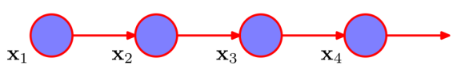
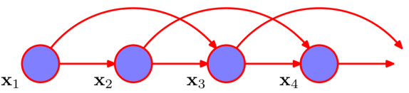
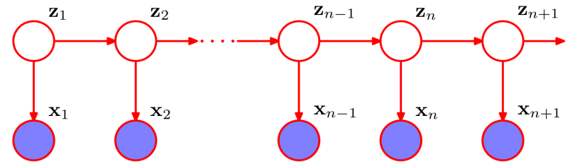

# CS329 Final Review(HMM)

*Course: Machine Learning(H)(CS329) - Instructor: Qi Hao*

Name: Jianan Xie(谢嘉楠)

SID: 12110714

**Textbook resource**: https://www.microsoft.com/en-us/research/people/cmbishop/#prml-book

**Textbook Python codes** : https://github.com/ctgk/PRML

**Course Website**: [http://hqlab.isus.tech/teaching/CS405/](http://hqlab.isus.tech/teaching/CS405/)

## Hidden Markov Models

#### 1. Hidden Markov Models

**观测序列的联合概率分布**
$$
p(x_1,\dots,x_N)=\prod_{n=1}^{N}p(x_n|x_1,\dots,x_{n-1})
$$
**一阶马尔科夫链**：指每个条件分布只与最近的一次观测有关，即 $p(x_n|x_1,\dots,x_{n-1})=p(x_n|x_{n-1})$
$$
p(x_1,\dots,x_N)=p(x_1)\prod_{n=2}^{N}p(x_n|x_{n-1})
$$

**二阶马尔科夫链**：指每个条件分布与最近的两次观测有关，即 $p(x_n|x_1,\dots,x_{n-1})=p(x_n|x_{n-1},x_{n-2})$
$$
p(x_1,\dots,x_N)=p(x_1)p(x_2|x_1)\prod_{n=3}^{N}p(x_n|x_{n-1},x_{n-2})
$$

​		假设观测是具有 K 个状态的离散变量，那么一阶马尔科夫链中条件概率分布 $p(x_n|x_{n-1})$ 由 $K-1$ 个参数指定，每个参数都对应$x_{n-1}$ 的 k 个状态，所以参数总数为 $K(K-1)$，那么对于M阶马尔科夫链，参数总数为 $K^M(K-1)$. 对于高阶HMM，这是不可取的，所以我们引入隐变量$z$(类型或维度可能与观测变量不同)，从而构造任意阶数的马尔科夫链。$z$隐变量需要满足**独立**性质，即给定 $z_n$ 的条件下，$z_{n-1}$ 和 $z_{n+1}$ 是独立的。

​		而对于观测为连续变量时，我们可以用线性高斯条件概率分布，其中每个节点都是一个高斯概率分布，均值是父节点的一个线性函数

**HMM的联合概率分布**
$$
p(x_1,\dots,x_N,z_1,\dots,z_N)=p(z_1)[\prod_{n=2}^{N}p(z_n|z_{n-1})]\prod_{n=1}^{N}p(x_n|z_n)
$$

**详细介绍HMM**

1. $z_n$ 是离散且满足多项式分布的，并用于描述哪个混合分量用于生成对应的观测 $x_n$，且 $z_n$ 使用 1-of-K 的表示方法(coding scheme)。更加具体的描述是，$z_n$是 K 维的二值变量，隐变量构成了马尔科夫链，得到的图结构被称为状态空间模型(state space model)

2. 条件概率分布对应于一个转移矩阵(transition matrix) $\mathbf{A}$，它的元素被称为转移概率(transition probabilities), 定义为$A_{jk}\equiv p(z_{nk}=1|z_{n-1,j}=1)$。其中，$0\leq A_{jk} \leq 1$ 且 $\sum_kA_{jk}=1$，从而$\mathbf{A}$有 $K(K-1)$ 个独立的参数。

   可以理解为在HMM中，状态之间的转移概率跟隐变量$z_n$是无关的，仅由$\mathbf{A}$转移矩阵来决定，下面是$K=3$的转移矩阵图例：

   

3. 由此隐变量的条件概率可写为：
   $$
   p(z_n|z_{n-1},\mathbf{A})=\prod_{k=1}^K\prod_{j=1}^K\mathbf{A}_{jk}^{z_{n-1,j}z_{nk}}
   $$
     由于初始隐节点 $z_1$ 没有父节点，所以它的边缘概率分布 $p(z_1)$ 由一个概率向量 $\pi$ 表示， 其中 $\pi_k\equiv p(z_{1k}=1)$ 且 $\sum_k\pi_k=1$ :
   $$
   p(z_1|\pi)=\prod_{k=1}^K\pi_k^{z_{1k}}
   $$
   

   图中每一列代表一个隐变量，不同k代表不同的状态的分量，而连线指的是转移矩阵$\mathbf{A}$，即每条连线的值对应$\mathbf{A}$中一个元素，代表从前一个隐变量的某个状态转移到下一个隐变量的某个状态的转移概率，每一行代表同一状态下的隐变量序列

4. 观测变量的条件概率分布的进一步定义为:
   $$
   p(x_n|z_n,\phi)=\prod_{k=1}^K p(x_n|\phi_k)^{z_{nk}}
   $$
   其中 $\phi$ 是控制该概率分布的参数集合， 这个条件概率分布也被称之为发射概率(emission probabilities)，它可以是高斯分布(x is continuous) 或者 条件概率表格(x is discrete)。该概率由一个 K 维的向量组成，对应二值向量$z_n$的 K 个可能状态。

5. 这样我们完整的数学定义HMM如下所示：
   $$
   \begin{align}
   p(x_n|z_n,\phi)&=\prod_{k=1}^K p(x_n|\phi_k)^{z_{nk}},\quad p(z_n|z_{n-1},\mathbf{A})=\prod_{k=1}^K\prod_{j=1}^K\mathbf{A}_{jk}^{z_{n-1,j}z_{nk}}\\
   p(\mathbf{X,Z|\theta})&=p(z_1|\pi)[\prod_{n=2}^{N}p(z_n|z_{n-1},\mathbf{A}]\prod_{m=1}^{N}p(x_m|z_m,\phi)\\
   \mathbf{X}&=\{x_1,\dots,x_N\},\quad \mathbf{Z}=\{z_1,\dots,z_N\},\quad \mathbf{\theta}=\{\pi,\mathbf{A},\phi\}
   \end{align}
   $$

	#### 2.Three Problems for HMMs

- **Evaluation**: Given a HMM model $\theta=\{\pi,\mathbf{A},\phi\}$, what is likelihood of an observation sequence $\{x_1,\dots,x_N\}$ generated by that model?
- **Learning**: What is the most likely HMM model for an observation sequence $\{x_1,\dots,x_N\}$?
- **Decoding**: Given a HMM model $\theta=\{\pi,\mathbf{A},\phi\}$, what is the most likely latent sequence $\{z_1,\dots,z_N\}$ for an observation sequence $\{x_1,\dots,x_N\}$?

#### Learning：What is the most likely HMM model for an observation sequence $\{x_1,\dots,x_N\}$?

先引入一些记号，为方便后续推导。$\gamma(z_n)$ 表示隐变量$z_n$的边缘概率分布($K$ dim)，$\xi(z_{n-1},z_n)$ ($K\times K$)表示两个连续的隐变量的联合后验概率分布：
$$
\gamma(z_n)=p(z_n|\mathbf{X,\theta^{old}}), \quad \xi(z_{n-1},z_n)=p(z_{n-1},z_n|\mathbf{X,\theta^{old}})
$$
根据记号定义我们可知，$\gamma(z_{nk})$可以表示$z_{nk}=1$的概率，也即$\mathbb E[z_{nk}]$，因为$z_n$为1-of-K 表示。$\xi(z_{n-1,j},z_{nk})$同理:
$$
\gamma(z_{nk})=\mathbb E[z_{nk}]=\sum_{z_n}\gamma(z_n)z_{nk},\quad \xi(z_{n-1,j},z_{nk})=\mathbb E[z_{n-1,j},z_{nk}]=\sum_{z_{n-1},z_n}\xi(z_{n-1},z_n)z_{n-1,j}z_{nk}
$$
**ML** for HMM:
$$
p(X|\theta)=\sum_z p(\mathbf{X,Z|\theta})
$$
**EM algorithm** to find an efficient framework(这里的Q函数是利用隐变量后验概率计算对数似然的期望函数)
$$
\begin{align}
Q(\theta,\theta^{old})&=\sum_\mathbf{Z} p(\mathbf{Z|X,\theta^{old}}) \ln p(\mathbf{X,Z|\theta})
\\Q(\theta,\theta^{old})&=\sum_{k=1}^K\gamma(z_{1k})\ln\pi_k+\sum_{n=2}^{N}\sum_{j=1}^{K}\sum_{k=1}^K\xi(z_{n-1,j},z_{nk})\ln\mathbf{A_{jk}}+\sum_{n=1}^N\sum_{k=1}^K\gamma(z_{nk})\ln p(x_n|\phi_k) 
\end{align}
$$
**E Step**: 高效地计算$\gamma(z_n)$ 和 $\xi(z_{n-1},z_n)$，具体如何高效下面 sum of product 部分会详细介绍

**M Step**: 关于参数$\theta=\{\pi,\mathbf{A},\phi\}$来最大化$Q(\theta,\theta^{old})$， 由拉格朗日乘数法易得:
$$
\pi_k=\frac{\gamma(z_{1k})}{\sum_{j=1}^{K}\gamma(z_{1j})}, \quad \mathbf{A_{jk}}=\frac{\sum_{n=2}^N \xi(z_{n-1,j},z_{nk})}{\sum_{l=1}^K\sum_{n=2}^N\xi(z_{n-1,j},z_{nl})}
$$

- 对于观测变量为连续值，假设观测变量服从高斯分布$p(x|\phi_k)=N(x|\mu_k,\Sigma_k)$，则发射概率为$p(x|z)=\prod_{k=1}^KN(x|\mu_k,\Sigma_k)^{z_k}$，最大化$Q(\theta,\theta^{old})$得到：
  $$
  \mu_k = \frac{\sum_{n=1}^N\gamma(z_{nk})x_n}{\sum_{n=1}^N\gamma(z_{nk})}, \quad \Sigma_k=\frac{\sum_{n=1}^N\gamma(z_{nk})(x_n-\mu_k)(x_n-\mu_k)^\rm{T}}{\sum_{n=1}^N \gamma(z_{nk})}
  $$

- 对于离散观测变量，假设观测变量服从多项式分布，则发射概率为$p(x|z)=\prod_{i=1}^D\prod_{k=1}^K \mu_{ik}^{x_iz_k}$，最大化$Q(\theta,\theta^{old})$得到：
  $$
  \mu_{ik}=\frac{\sum_{n=1}^N\gamma(z_{nk})x_{ni}}{\sum_{n=1}^N \gamma(z_{nk})}
  $$

##### 现在我们介绍如何如何高效计算**E Step**:

经典的算法利用alpha-beta的forward-backward算法，其中$\alpha(z_n)$表示观测到时刻n及其之前时刻的所有数据和$z_n$的联合概率，而$\beta(z_n)$表示给定$z_n$的条件下，从时刻n+1到N的所有未来数据的条件概率。$\alpha(z_n)$ 和 $\beta(z_n)$ 与前面的$\gamma(z_n)$ 类似都是具有 K 个值的变量，我们同样将他们对应到$z_n$的1-of-K 的表示方法，即$\alpha(z_{nk})$表示$z_{nk}=1$时的概率，$\beta(z_{nk})$同理

值得强调的是，隐变量$z_n$的后验概率分布计算与发射概率密度的形式无关，也与观测变量是连续还是离散无关。

首先，列举一些条件独立性质(Jordan, 2007)
$$
\begin{align}
p(\mathbf{X}|z_n)&=p(x_1,\dots,x_n|z_n)p(x_{n+1},\dots,x_N|z_n)\tag{1}
\\p(x_1,\dots,x_{n-1}|x_n,z_n)&=p(x_1,\dots,x_{n-1}|z_n) \tag{2}
\\p(x_1,\dots,x_{n-1}|z_{n-1},z_n)&=p(x_1,\dots,x_{n-1}|z_{n-1}) \tag{3}
\\p(x_{n+1},\dots,x_N|z_n,z_{n+1})&=p(x_{n+1},\dots,x_N|z_{n+1}) \tag{4}
\\p(x_{n+2},\dots,x_N|z_{n+1},x_{n+1})&=p(x_{n+2},\dots,x_N|z_{n+1}) \tag{5}
\\p(\mathbf{X}|z_{n-1},z_{n})&=p(x1,\dots,x_{n-1}|z_{n-1})p(x_n|z_n)p(x_{n+1},\dots,x_N|z_n)\tag{6}
\\p(x_{N+1}|\mathbf{X},z_{N+1})&=p(x_{N+1}|z_{N+1}) \tag{7}
\\p(z_{N+1}|z_{N},\mathbf{X})&=p(z_{N+1}|z_N)\tag{8}
\end{align}
$$
根据定义:
$$
\alpha(z_n)\equiv p(x_1,\dots,x_n,z_n),\quad \beta(z_n)\equiv p(x_{n+1},\dots,x_N|z_n)
$$
$\alpha(z_n)$ 和 $\beta(z_n)$ 的推导式：
$$
\begin{align}
\alpha(z_n)&=p(x_1,\dots,x_n,z_n)\\
&=p(x_n|z_n)p(x_1,\dots,x_{n-1},z_n)\\
&=p(x_n|z_n)\sum_{z_{n-1}}p(x_1,\dots,x_{n-1},z_{n-1},z_n)\\
&=p(x_n|z_n)\sum_{z_{n-1}}p(x_1,\dots,x_{n-1},z_{n-1})p(z_n|z_{n-1})\\
&=p(x_n|z_n)\sum_{z_{n-1}}\alpha(z_{n-1})p(z_n|z_{n-1})
\\
\\
\beta(z_n)&=p(x_{n+1},\dots,x_N|z_n)\\
&=\sum_{z_{n+1}}p(x_{n+1},\dots,x_N,z_{n+1}|z_n)\\
&=\sum_{z_{n+1}}p(x_{n+1},\dots,x_N|z_n,z_{n+1})p(z_{n+1}|z_n)\\
&=\sum_{z_{n+1}}p(x_{n+1},\dots,x_N|z_{n+1})p(z_{n+1}|z_n) \tag{according (4)}
\\&=\sum_{z_{n+1}}p(x_{n+2},\dots,x_N|z_{n+1})p(x_{n+1}|z_{n+1})p(z_{n+1}|z_n)
\\&=\sum_{z_{n+1}}\beta(z_{n+1})p(x_{n+1}|z_{n+1})p(z_{n+1}|z_n)
\end{align}
$$
$a(z_n)$ 和 $\beta(z_n)$ 的初始条件分别为: 
$$
\begin{align}
\alpha(z_1)=p(x_1,z_1)=p(z_1)p(x_1|z_1)&=\prod_{k=1}^K\{\pi_kp(x_1|\phi_k)\}^{z_{1k}} \tag{由$\alpha(z_n)$定义}
\\\beta(z_N)&=\frac{p(z_N|\mathbf{X})p(\mathbf{X})}{p(\mathbf{X},z_N)} \tag{由$\gamma(z_N$)计算，$\beta(z_N)=\mathbf{1}$}
\end{align}
$$
进一步，我们可以得到$\gamma(z_n)$和$\xi(z_{n-1},z_n)$:
$$
\begin{align}
\gamma(z_n)=p(z_n|\mathbf{X})&=\frac{p(\mathbf{X}|z_n)p(z_n)}{p(\mathbf{X})}\\
&=\frac{p(x_1,\dots,x_n,z_n)p(x_{n+1},\dots,x_N|z_n)}{p(\mathbf{X})}\\
&=\frac{\alpha(z_n)\beta(z_n)}{p(\mathbf{X})}
\\
\\
\xi(z_{n-1},z_n)=p(z_{n-1},z_n|\mathbf{X})&=\frac{\alpha(z_{n-1})p(x_n|z_n)p(z_n|z_{n-1})\beta(z_n)}{p(\mathbf{X})}
\end{align}
$$
我们同样可以将$\gamma(z_n)$和$\xi(z_{n-1},z_n)$带入**M**步骤中得到$\pi_k,\mathbf{A_{jk}},\mu_k$等参数的$\alpha(z_n),\beta(z_n)$表示

下面基于forward backward算法总结一下**EM过程**：

- **E Step:**
  1. 初始化参数$\theta^{old}$，其中 $\mathbf{A},\pi$ 需要均匀初始化或者从均匀分布中随机初始化(满足$0\leq A_{jk},\pi_k \leq 1$ 且 $\sum_kA_{jk}=1,\sum_k\pi_k=1$)，而$\phi$的初始化取决于观测变量的分布，例如高斯分布的情况下可以利用K均值算法初始化 $\mu_k$ 和 $\Sigma_k$ 
  2. 运行 forward backward Algorithm 得到隐马尔科夫链上的所有$\alpha(z_n)$ 和 $\beta(z_n)$，并利用这些值计算$\gamma(z_n)$ 和 $\xi(z_{n-1},z_n)$，最后计算对数似然函数 $\ln p(\mathbf{X,Z|\theta})$ 
- **M step:** 关于参数$\theta=\{\pi,\mathbf{A},\phi\}$来最大化$Q(\theta,\theta^{old})$，得到 $\theta^{new}$
- 交替进行 **EM 步骤**， 直到对数似然函数的增长小于某设定阈值后算法结束

#### Evaluation: Given a HMM model $\theta=\{\pi,\mathbf{A},\phi\}$, what is likelihood of an observation sequence $\{x_1,\dots,x_N\}$ generated by that model?

根据上面对$\alpha(z_n)$ 与 $\beta(z_n)$ 的定义，似然函数 则可以进一步表达为:
$$
p(\mathbf{X})=\sum_{z_n}p(x_1,\dots,x_N,z_n)=\sum_{z_n}\alpha(z_n)\beta(z_n)
$$
我们可以选择一个合适的n用于方便计算该最大似然，比如取$n=N$，则利用$\beta_N$为元素全1向量得到 $p(\mathbf{X})=\sum_{z_N}\alpha(z_N)$

#### Observation Prediction

$$
\begin{align}
p(x_{N+1}|\mathbf{X})&=\sum_{z_{N+1}}p(x_{N+1},z_{N+1}|\mathbf{X})\\
&=\sum_{z_{N+1}}p(x_{N+1}|z_{N+1})p(z_{N+1}|\mathbf{X})\\
&=\sum_{z_{N+1}}p(x_{N+1}|z_{N+1})\sum_{z_N}p(z_{N+1},z_N|\mathbf{X})\\
&=\sum_{z_{N+1}}p(x_{N+1}|z_{N+1})\sum_{z_N}p(z_{N+1}|z_N)p(z_N|\mathbf{X})\\
&=\sum_{z_{N+1}}p(x_{N+1}|z_{N+1})\sum_{z_N}p(z_{N+1}|z_N)\frac{p(z_N,\mathbf{X})}{p(\mathbf{X})}\\
&=\frac{1}{p(\mathbf{X})}\sum_{z_{N+1}}p(x_{N+1}|z_{N+1})\sum_{z_N}p(z_{N+1}|z_N)\alpha(z_N)
\end{align}
$$

Tips: 上述计算 $\alpha(z_n)$ 与 $\beta(z_n)$ 包括这里的 $p(x_{N+1}|\mathbf{X})$ 都涉及到了 $p(x_n|z_n)$ 和 $p(z_{n+1}|z_n)$ 这两个概率，提醒一下这两个概率都是已知的，$p(x_n|z_n)$ 为发射密度，$p(z_{n+1}|z_n)$ 利用转移矩阵 $\mathbf{A}$ 计算。

> #### Sum-Product Algorithm
>
> 隐马尔科夫模型的有向图是一棵树，这代表了我们可以用sum-product algorithm来求解寻找局部边缘概率的问题，这等价于前面所讲的forward backward algorithm，即sum-product algorithm 提供了一种简单推导alpha-beta递归公式(涉及到 factor graph， 暂时未学，故不深究，有待补充)

#### Decoding: Given a HMM model $\theta=\{\pi,\mathbf{A},\phi\}$, what is the most likely latent sequence $\{z_1,\dots,z_N\}$ for an observation sequence $\{x_1,\dots,x_N\}$?

> Tips: 解码过程是为了 find the most probable sequence of latent states 而不是为了 find the set of states that are individually the most probable。即为了找到最有可能的隐变量组成的隐马尔科夫链，而不是仅仅为了使每个隐变量的条件概率分布 $\gamma(z_n)$ 最大。如果为了解决后者，我们只需要利用forward backward算法，得到 $\gamma(z_n)$ 然后单独的最大化每个 $\gamma(z_n)$ 即可(Duda et al., 2001)。

该过程由 Max-Product Algorithm 给出，这个算法也被称之为 维特比算法(Viterbi algorithm)。同样的由于factor graph 暂未学习，所以这里省去利用因子图计算的公式推导。

我们直接通过HMM的联合概率分布推导
$$
\begin{align}
w(z_n)&=\underset{z_1,\dots,z_{n-1}}{max}\ln p(x_1,\dots,x_n,z_1,\dots,z_n)\\
w(z_{n+1})&=\underset{z_1,\dots,z_{n}}{max}\ln p(x_1,\dots,x_n,x_{n+1},z_1,\dots,z_n,z_{n+1})
\\
\\
w(z_{n+1}) &= \ln p(x_{n+1}|z_{n+1}) + \underset{z_n}{max}\{\ln p(z_{n+1}|z_n)+w(z_n)\} \tag{递推关系式}
\\
w(z_1) &= \ln p(z_1) + \ln p(x_1|z_1) \tag{初始条件}
\end{align}
$$
需要注意的是 $z_n$ 最大化的过程必须在 $z_{n+1}$ 的 $K$ 个可能值上的每一个值进行，对于 $z_{n+1}$ 的 $K$ 个值中的每一个值，我们记 $\psi(k_n)$ 代表与最大值相对应的 $z_n$ 的值，则一旦我们找到了概率最大的 状态 $z_N$ ，我们可以沿着马尔科夫链反向追踪 $k_n^{max}=\psi(k_{n+1}^{max})$ 。

#### Example：

**1. Given an HMM and an observation sequence, how to perform evaluation and decoding**

Preliminary: Transition Matrix $\mathbf{A}=\begin{bmatrix}0.6 & 0.3 \\0.4&0.7 \end{bmatrix}$，where $a_{ij}\equiv p(z_{n+1}=i|z_n=j)$，具体一点在本题中$\mathbf{A}$为 $\begin{bmatrix}bull\rightarrow bull&bear\rightarrow bull\\bull\rightarrow bear & bear\rightarrow bear\end{bmatrix}$， Emission $\mathbf{B}=\begin{bmatrix}0.8 & 0.1 \\0.2 & 0.9\end{bmatrix}$，where $b_{ij}\equiv  p(x_n=i|z_n=j)$，Hidden States $z_n\in\{bull,bear\}$，Obeservation $x_n\in\{up,down\}$

Given conditions： Observation sequence $\mathbf{X} = \{up, up,down\}$, $\pi = [0.5, 0.5]$

Solution: First execute forward backward algorithm to get $\alpha(z_n)$ and using formula $p(\mathbf{X})=\sum_{z_N}\alpha(z_N)$ to get the evaluation.

##### Evaluation(Sum-Product):

> Related formulas:
>
> $$\alpha(z_1)=p(x_1,z_1)=p(z_1)p(x_1|z_1)=\prod_{k=1}^K\{\pi_kp(x_1|\phi_k)\}^{z_{1k}}$$ (initial formula)
>
> $$\alpha(z_n)=p(x_n|z_n)\sum_{z_{n-1}}\alpha(z_{n-1})p(z_n|z_{n-1})$$ (recurssion formula)

$$
\begin{align}
\alpha(z_1) &=p(z_1)p(x_1|z_1)
=\begin{bmatrix}0.8\\0.1\end{bmatrix}\dot{}\begin{bmatrix}0.5\\0.5\end{bmatrix}=\begin{bmatrix}0.4\\0.05\end{bmatrix} \tag{$x_1=up$}
\\\alpha(z_2)&=p(x_2|z_2)\sum_{z_1}\alpha(z_1)p(z_2|z_1)
=\begin{bmatrix}0.8\\0.1\end{bmatrix}\dot{}\begin{bmatrix}0.4\times0.6 +0.05\times0.3\\ 0.4\times0.4+0.05\times 0.7\end{bmatrix}=\begin{bmatrix}0.204\\0.0195\end{bmatrix}\tag{$x_2=up$}\\
\\\alpha(z_3)&=p(x_3|z_3)\sum_{z_2}\alpha(z_2)p(z_3|z_2)
=\begin{bmatrix}0.2\\0.9\end{bmatrix}\dot{}\begin{bmatrix}0.204\times0.6 +0.0195\times0.3\\ 0.204\times0.4+0.0195\times 0.7\end{bmatrix}=\begin{bmatrix}0.02565\\0.085725\end{bmatrix}\tag{$x_3=down$}\\
p(\mathbf{X})&=\sum_{z_3}\alpha(z_3)=0.02565+0.085725= 0.111375
\end{align}
$$

##### Decoding(Max-Product):

> 这里取$$\delta(z_n)=\exp(w(z_n))$$，即不需要利用decoding中所定义的$w(z_n)$而是直接进行最大化操作

$$
\begin{align}
\delta(z_1)&=p(x_1|z_1)p(z_1)=\begin{bmatrix}0.8\\0.1\end{bmatrix}\dot{}\begin{bmatrix}0.5\\0.5\end{bmatrix}=\begin{bmatrix}0.4\\0.05\end{bmatrix} \tag{$x_1=up$}\\
\delta(z_2)&=p(x_2|z_2)\underset{z_1}{max}\{p(z_2|z_1)\delta(z_1)\}\\&=\begin{bmatrix}0.8\\0.1\end{bmatrix}\dot{}\begin{bmatrix}max(0.6\times0.4,0.3\times0.05)\\max(0.4\times0.4,0.05\times0.7)\end{bmatrix}=\begin{bmatrix}0.8\\0.1\end{bmatrix}\dot{}\begin{bmatrix}0.6\times0.4\\0.4\times0.4\end{bmatrix}=\begin{bmatrix}0.192\\0.016\end{bmatrix}\tag{$x_2=up$}\\\psi(z_2)&=arg\underset{z_1}{max}\{p(z_2|z_1)\delta(z_1)\}=\begin{bmatrix}bull\rightarrow bull\\bull\rightarrow bear\end{bmatrix}\\
\delta(z_3)&=p(x_3|z_3)\underset{z_2}{max}\{p(z_3|z_2)\delta(z_2)\}\\&=\begin{bmatrix}0.2\\0.9\end{bmatrix}\dot{} \begin{bmatrix}max(0.192\times0.6,0.016\times0.3)\\max(0.192\times0.4,0.016\times0.7)\end{bmatrix}=\begin{bmatrix}0.2\\0.9\end{bmatrix}\dot{}\begin{bmatrix}0.192\times0.6\\0.192\times0.4\end{bmatrix}=\begin{bmatrix}0.02304\\0.06912\end{bmatrix}\tag{$x_3=down$}\\
\\\psi(z_3)&=arg\underset{z_2}{max}\{p(z_3|z_2)\delta(z_2)\}=\begin{bmatrix}bull\rightarrow bull\\bull\rightarrow bear\end{bmatrix}\\
\end{align}
$$
根据 $\delta(z_3)$ 我们得到 $z_3$ 的最大概率状态为 $bear$ (0.06912>0.02304)，则接下来根据 $\psi(z_3)$ 函数得到当 $z_3$ 状态为 $bear$ 时，对应 $z_2$ 状态为 $bull$ ，再根据 $\psi(z_2)$ 得到当 $z_2$ 状态为 $bull$ 时，对应 $z_1$ 状态为 $bull$，所以对应的隐变量马尔科夫链为 $bull\rightarrow bull \rightarrow bear$ 。
