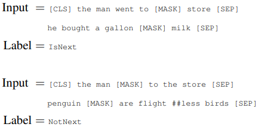
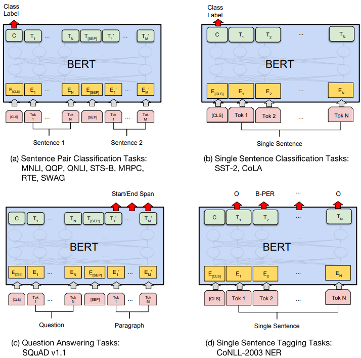
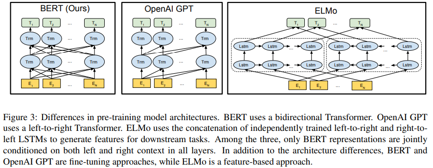
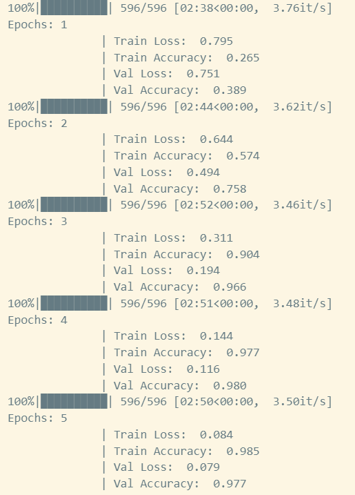

## BERT

- [BERT](#bert)
  - [Intro:](#intro)
  - [Model architecture](#model-architecture)
  - [Input/Output](#inputoutput)
  - [Principle:](#principle)
    - [Embeddings](#embeddings)
    - [Pre-training](#pre-training)
    - [Fine-tuning](#fine-tuning)
  - [Comparison](#comparison)
  - [代码调用](#代码调用)

### Intro:

- **BERT(Bidirectional Encoder Representation from Transformers)**是2018年10月由Google AI研究院发表的一篇名为[《BERT: Pre-training of Deep Bidirectional Transformers for Language Understanding》](https://arxiv.org/abs/1810.04805)的文章提出的一种预训练模型，该模型在机器阅读理解顶级水平测试SQuAD1.1中表现出惊人的成绩: 全部两个衡量指标上全面超越人类，并且在11种不同NLP测试中创出SOTA表现，包括将GLUE基准推高至80.4% (绝对改进7.6%)，MNLI准确度达到86.7% (绝对改进5.6%)，成为NLP发展史上的里程碑式的模型成就。

- BERT的网络架构使用的是《Attention is all you need》中提出的多层Transformer结构。其最大的特点是抛弃了传统的RNN和CNN，通过Attention机制将任意位置的两个单词的距离转换成1，有效的解决了NLP中棘手的长期依赖问题。Transformer的结构在NLP领域中已经得到了广泛应用。


$$
fig1.Transformer \; Architecture
$$


### Model architecture

简单来讲，BERT就是由多层bidirectional Transformer encoder堆叠而成。Bidirectional指的是在MLM训练任务中利用上下文token做预测训练。

|             | L(# layers) | H(hidden size) | A(# heads) | Total Parameters |
| ----------- | ----------- | -------------- | ---------- | ---------------- |
| BERT(base)  | 12          | 768            | 12         | 110M             |
| BERT(large) | 24          | 1024           | 16         | 340M             |


$$
fig2.BERT \; simple \; architecture
$$


### Input/Output

- One sentence or a pair of  sentences(e.g.<Question, Answer>)

- 每个sequence的第一个token是[CLS]，用于分类，对于非分类模型，该符号可以省去。
- 每个sequence的最后一个token是[SEP]，表示分句符号，用于断开输入语料中的两个句子
- The final hidden vector of [CLS] token as $C \in \R^H$, the final hidden vector for the $i^{th}$ input token is $T_i \in \R^H$. C可以作为整句话的语义表示，从而用于下游的分类任务等。[CLS]本身没有语义，因而经过12层self-attention相比其他词更能表示整句话的语义。


### Principle:

BERT在嵌入层以及预训练任务和模型微调方面有自己的独特创新，下面我们将分别介绍BERT如何对input做embedding以及BERT是怎么被预训练的，还有我们可能更加关心的如何运用模型。


#### Embeddings

Input的embeddings是由词嵌入(token embeddings)、段落嵌入(segment embedding)以及位置嵌入(position embeddings)相加而得的。

- Token Embeddings: 词向量，通过建立字向量将每个word转化成一个一维向量，特别的英文单词会做更细粒度的切分(playing = play + ##ing)。
  - 输入文本后，tokenizer会对文本进行tokenization处理，两个特殊的token会插入在文本开头[CLS]和文本结尾[SEP].
  - Token Embeddings层会将每个word转化为768维向量

- Segment Embeddings:用于区别两种句子，bert能处理句子对语义相似任务，当两个句子被简单拼接后送入模型中，bert利用该embeddings区分两个句子
  - segment embeddings层有两种向量表示，前一个向量把0赋值给第一个句子的各个token，后一个向量把1赋给第二个句子的各个token
  - 文本分类任务只有一个句子，那么segment embeddings就全是0
- Position Embeddings:位置向量，与transformer中的三角函数固定编码不同，随机初始化后通过数据训练学习的，不仅可以标记位置还可以学习到这个位置有什么用


$$
fig3.Input \; Embeddings=Token\;Embeddings+Segment\;Embddings+Position\;Embeddings
$$


#### Pre-training

摒弃传统利用left-to-right language model和right-to-left language model 来预训练bert，而是用两个特殊的unsupervised任务来初始化参数：MLM，NSP。预训练采用BooksCorpus(800M words) and English Wikipedia(2500M words)。


$$
fig4. Two\;stages\;of\;BERT
$$

- Masked LM:利用以一定的机制掩盖input中的target tokens的方式训练模型利用上下文推理预测被掩盖词的能力(类似完型填空)
  - sequence的15%会被选择为target tokens，对每个被选择的位置上的token，通过一系列实验测试得到最为理想的mask strategy:
    - 80%的概率mask target token，即tokenize为[MASK]
    - 10%的概率不mask该target token，即不对input不做任何修改
    - 10%的概率替换该target token为其他随机token
  - 训练过程就是通过用上述策略修改input后，将final hidden vector中对应被mask的token $T_i$ 扔到基于词汇表的softmax函数里进行预测，训练采用cross entropy loss
  - 为什么要用这样的策略:如果句子中的target tokens被100% masked的话，fine-tuning过程中模型就会碰到没有见过的单词，而加入随机token和保持不变的意义是为了缓解上述问题
  - 该训练任务的缺点是有时候会随机mask一些本具有连续意义的词，使得模型不容易学得词的语义信息，这在google后续发布的BERT-WWM中得到解决


$$
fig5. Masking \; strategy
$$

- Next Sentence Prediction: 许多重要的下游任务，如问答(QA)和自然语言推理(NLI)，都是基于对两个句子之间关系的理解，而语言建模并没有直接捕捉到这些关系。为了训练一个理解句子关系的模型，我们预先训练了一个可以从任何单语语料库中生成的二值化下一个句子预测任务。判断句子B是否是句子A的下文。如果是的话输出’IsNext‘，否则输出’NotNext‘

  - 训练数据的生成方式是从平行语料中随机抽取的连续两句话，其中50%保留抽取的两句话，它们符合IsNext关系，另外50%的第二句话是随机从预料中提取的，它们的关系是NotNext的。
  - 利用之前提到的输出层[CLS]，用于做分类任务
  - 在此后的研究（论文《Crosslingual language model pretraining》等）中发现，NSP任务可能并不是必要的，消除NSP损失在下游任务的性能上能够与原始BERT持平或略有提高。针对这一点，后续的RoBERTa、ALBERT、spanBERT都移去了NSP任务。


$$
fig6.Example \;input\;and \; corresponding \; output\; in\; NSP\;task
$$


#### Fine-tuning

微调基于预训练好的模型，对具体的下游任务，进行参数的微调。该步骤体现了预训练的强大作用，它使得预训练大模型得以在相关的各种下游任务中高效地取得理想表现。



$$
fig7. Fine\;tuning\;tasks
$$
模型出处在上方的NLP的四个领域的11个经典benchmark实验中进行测试，均取得显著提升，达到SOTA水平


### Comparison




分析比较BERT，OpenAI GPT 和 ELMo

|      | BERT                      | OpenAI GPT                | ELMo                                 |
| ---- | ------------------------- | ------------------------- | ------------------------------------ |
| 架构 | bidirectional transformer | left-to-right transformer | left-to-right and right-to-left LSTM |
| 方法 | fine-tuning               | fine-tuning               | feature-based                        |


BERT与近年大热的GPT的区别：

- BERT利用transformer encoder侧网络，利用上下文信息编码token，GPT利用decoder侧网络，left-to-right的架构使得它适用于文本生成。

- GPT仅在BooksCorpus语料库上进行训练，而BERT在BooksCorpus和Wikipedia上进行训练
- GPT仅在fine-tuning时引入[CLS]和[SEP]，而BERT在预训练阶段学习[SEP],[CLS]以及A/B embeddings
- GPT was trained for 1M steps with a batch size of 32000 words, BERT was trained fro 1M steps with a batch size of 128000 words.
- GPT在所有fine-tuning实验中都统一采用$5e^{-5}$的学习率，而BERT需要根据情况选取最优的


### Conclusion

BERT基于Transformer架构，采用多头自注意力机制进行信息挖掘，并利用大量无标签语言数据进行预训练，通过自学习捕捉语言模式。预训练的目的是让模型学习到通用的语言表示，这些表示可以用于多种自然语言处理任务，如情感分析、命名实体识别、问答等。在预训练完成后，BERT模型需要进行微调以适配特定的任务，该过程将预训练模型输入特定任务的数据，并通过一套较小的网络结构进行微调。利用预训练好的BERT(如加载Hugging Face仓库)，我们可以很方便的在我们所需要的任务上运用强大的BERT。


### 代码调用（以文本分类为例）

Hugging Face为我们提供了方便的BERT接口，我们在下面的BERT运用示例中仅需要调用的是，Transformers 库内的BertModel和BertTokenizer模块。尚未安装对应第三方库的，运行`pip install transformers`即可。

对BERT相关模型，或者感兴趣如何配置自定义的BERT框架以及自己预训练BERT，可以参考Huggface的[Bert模块配置详情](https://huggingface.co/transformers/v3.0.2/model_doc/bert.html)。

下面的代码块展示了，BertModel和BertTokenizer模块中一些方法的运用

```python
from transformers import BertModel,BertTokenizer
BERT_PATH = 'bert-base-cased' #区别大小写的Bert_case,可以指定预训练的Bert模型配置文件路径
tokenizer = BertTokenizer.from_pretrained(BERT_PATH)
print(tokenizer.tokenize('My dog is cute, he likes playing.'))
#['My', 'dog', 'is', 'cute', ',', 'he', 'likes', 'playing', '.']
bert = BertModel.from_pretrained(BERT_PATH)

example_text = 'I will watch Memento tonight'
bert_input = tokenizer(example_text,padding='max_length',#padding用于将每个sequence填充到指定的最大长度
                       max_length = 10,               #max_length用于指定每个sequence的最大长度
                       truncation=True,          #truncation为true代表每个序列中超过最大长度的标记将被截断
                       return_tensors="pt")#return_tensors设置返回的张量类型，'pt'->pytorch,'ft'->tensorflow
# ------- bert_input ------
print(tokenizer.tokenize(example_text))
#['I', 'will', 'watch', 'Me', '##mento', 'tonight']

print(bert_input['input_ids'])#每个token的id，可以用decode来解码id得到token
#tensor([[  101,   146,  1209,  2824,  2508, 26173,  3568,   102,     0,     0]])

print(tokenizer.encode(example_text))#预训练词汇表中的索引编号
#[101, 146, 1209, 2824, 2508, 26173, 3568, 102]

print(tokenizer.decode(bert_input.input_ids[0]))
#[CLS] I will watch Memento tonight [SEP] [PAD] [PAD]

print(bert_input['token_type_ids'])       #用于标识每个token哪个sequence，也就是position embeddings
#tensor([[0, 0, 0, 0, 0, 0, 0, 0, 0, 0]])

print(bert_input['attention_mask'])       #如果为0则为[PAD]，否则代表真实word或[CLS][SEP]，用于标记哪些位置是实际输入哪些是填充输入，防止[PAD]参与attention机制

```


下面我们以BBC新闻文本分类任务为例，展示BERT模型的一个简单用法，我们利用BERT模型学习表征，并在BERT输出处接一个简单的线性全连接层来做分类任务，最后能达到不错的分类效果。

```python
#数据集划分
data_train, data_valid= np.split(df_train.sample(frac=1,random_state=42)，[int(0.8*len(df_train))],axis=0)

#构建数据集类，以便后续采用Dataloader
tokenizer = BertTokenizer.from_pretrained('bert-base-cased')
labels = {'business':0,
          'entertainment':1,
          'sport':2,
          'tech':3,
          'politics':4
          }

class Dataset(torch.utils.data.Dataset):
    def __init__(self, df):
        self.labels = [labels[label] for label in df['category']]
        self.texts = [tokenizer(text, 
                                padding='max_length', 
                                max_length = 512, 
                                truncation=True,
                                return_tensors="pt") 
                      for text in df['text']]
        
    def __len__(self):
        return len(self.labels)

    def get_batch_labels(self, idx):
        # Fetch a batch of labels
        return np.array(self.labels[idx])

    def get_batch_texts(self, idx):
        # Fetch a batch of inputs
        return self.texts[idx]

    def __getitem__(self, idx):
        batch_texts = self.get_batch_texts(idx)
        batch_y = self.get_batch_labels(idx)
        return batch_texts, batch_y

#构建基于Bert的分类器，根据前面介绍，我们简单的在bert的final hidden layer之后加一个线性全连接网络，利用hidden layer的[CLS]作为线性网络的输入即可用于分类任务
class BertClassifier(nn.Module):
    def __init__(self, dropout=0.5):
        super(BertClassifier, self).__init__()
        self.bert = BertModel.from_pretrained('bert-base-cased')
        self.dropout = nn.Dropout(dropout)
        self.linear = nn.Linear(768, 5)#将768维语意表征向量映射到5维的类别概率向量上
        self.relu = nn.ReLU()

    def forward(self, input_id, mask):
        _, pooled_output = self.bert(input_ids= input_id, attention_mask=mask,return_dict=False)
        dropout_output = self.dropout(pooled_output)
        linear_output = self.linear(dropout_output)
        final_layer = self.relu(linear_output)
        return final_layer

#训练
def train(model, train_data, val_data, learning_rate, epochs):
  # 通过Dataset类获取训练和验证集
    train, val = Dataset(train_data), Dataset(val_data)
    # DataLoader根据batch_size获取数据，训练时选择打乱样本
    train_dataloader = torch.utils.data.DataLoader(train, batch_size=2, shuffle=True)
    val_dataloader = torch.utils.data.DataLoader(val, batch_size=2)
  # 判断是否使用GPU
    use_cuda = torch.cuda.is_available()
    device = torch.device("cuda" if use_cuda else "cpu")
    # 定义损失函数和优化器
    criterion = nn.CrossEntropyLoss()
    optimizer = Adam(model.parameters(), lr=learning_rate)

    if use_cuda:
            model = model.cuda()
            criterion = criterion.cuda()
    # 开始进入训练循环
    for epoch_num in range(epochs):
      # 定义两个变量，用于存储训练集的准确率和损失
            total_acc_train = 0
            total_loss_train = 0
            model.train() #设置模型为训练模式
      # 进度条函数tqdm
            for train_input, train_label in tqdm(train_dataloader):
                train_label = train_label.type(torch.LongTensor).to(device)
                mask = train_input['attention_mask'].to(device)
                input_id = train_input['input_ids'].squeeze(1).to(device)
                
                optimizer.zero_grad()#清空残留梯度
        # 通过模型得到输出
                output = model(input_id, mask)
                # 计算损失
                batch_loss = criterion(output, train_label)
                total_loss_train += batch_loss.item()
                # 计算精度
                acc = (output.argmax(dim=1) == train_label).sum().item()
                total_acc_train += acc
        # 模型更新
                batch_loss.backward()
                optimizer.step()
            # ------ 验证模型 -----------
            # 定义两个变量，用于存储验证集的准确率和损失
            total_acc_val = 0
            total_loss_val = 0
            model.eval() #设置模型为验证模式
      # 不需要计算梯度
            with torch.no_grad():
                # 循环获取数据集，并用训练好的模型进行验证
                for val_input, val_label in val_dataloader:
          # 如果有GPU，则使用GPU，接下来的操作同训练
                    val_label = val_label.type(torch.LongTensor).to(device)
                    mask = val_input['attention_mask'].to(device)
                    input_id = val_input['input_ids'].squeeze(1).to(device)

                    output = model(input_id, mask)

                    batch_loss = criterion(output, val_label)
                    total_loss_val += batch_loss.item()
                    
                    acc = (output.argmax(dim=1) == val_label).sum().item()
                    total_acc_val += acc
            
            print(
                f'''Epochs: {epoch_num + 1} 
              | Train Loss: {total_loss_train / len(train_data): .3f} 
              | Train Accuracy: {total_acc_train / len(train_data): .3f} 
              | Val Loss: {total_loss_val / len(val_data): .3f} 
              | Val Accuracy: {total_acc_val / len(val_data): .3f}''')
```

```
EPOCHS = 5
model = BertClassifier()
LR = 1e-6
train(model, data_train, data_valid, LR, EPOCHS)
```

